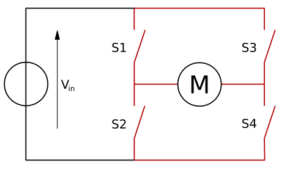

## Connecting a Motor

### H bridge

A motor can be driven forwards or backwards depending on which way around current flows through it. However, it would be awkward to have to rewire a motor, every time you want to change the direction it spins. To overcome this issue, motor controller boards include an H bridge. An H bridge uses 4 transistors to allow digital control of which way current flows through the motor. Most H bridges also contain *flyback diodes*. A flyback diode prevents the voltage spike that is generated by the motor when it is no longer powered (but still spinning) from damaging delicate electronics.

*Image credit: [Wikipedia](https://en.wikipedia.org/wiki/H_bridge){:target="_blank"}, CC BY-SA*

### Wiring

You'll need to wire up two motors and your battery pack using the motor controller.

+ With your Pi switched off, mount your motor controller board on the GPIO pins:

    

+ Connect a battery pack to the power ports of the motor controller, connecting the positive (red) battery wire to the positive (+) power terminal on the motor controller, and the negative (black) battery wire to the negative (-) power terminal on the motor controller, and connect two motors:

    

+ You'll need to know which GPIO pins your motor controller uses. Refer to the board's documentation. This will usually be described as Motor A and Motor B, or MA1, MA2, MB1, and MB2. Make a note of these pin numbers. If you're not sure which is which, you can investigate this next.